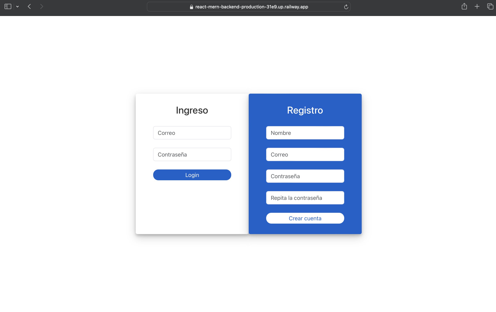

# 📅 Calendar App - Frontend

[](https://react.dev/)
[](https://redux-toolkit.js.org/)
[](https://vitejs.dev/)
[](https://jquense.github.io/react-big-calendar/)
[]()

> Modern, responsive React calendar application with real-time event management, Redux state management, and JWT authentication.

## 📋 Table of Contents

- [Project Description](#project-description)
- [Features](#features)
- [Tech Stack](#tech-stack)
- [Architecture](#architecture)
- [Redux Implementation](#redux-implementation)
- [Installation](#installation)
- [Configuration](#configuration)
- [Usage](#usage)
- [Project Structure](#project-structure)
- [Patterns and Best Practices](#patterns-and-best-practices)
- [Sustainability and Scalability](#sustainability-and-scalability)
- [Screenshots](#screenshots)
- [Deployment](#deployment)
- [Contributing](#contributing)

---

## 🎯 Project Description

This is a modern **React frontend** for a MERN calendar application (MongoDB, Express, React, Node.js). It provides a complete user interface that enables users to:

- ✅ Register and login securely
- ✅ Create, read, update, and delete events
- ✅ View events in an interactive calendar
- ✅ Manage their personal calendar with real-time UI updates
- ✅ Persist authentication with JWT tokens
- ✅ Auto-sync events with backend API

The frontend uses **Redux Toolkit** for centralized state management, ensuring predictable state updates and seamless data flow across components.

---

## ✨ Features

### 🗓️ Calendar Management
- Interactive calendar view with drag-and-drop event creation
- Real-time event updates without page reload
- Event creation, editing, and deletion
- Color-coded events with custom styling
- Event details modal with full information

### 🔐 Authentication & Security
- User registration and login
- JWT-based session management
- Automatic token renewal
- Protected routes (private/public)
- Secure token storage in localStorage

### 🎨 User Interface
- Responsive design (mobile, tablet, desktop)
- SweetAlert2 notifications for user feedback
- Modal-based event creation/editing
- Clean, intuitive layout
- Real-time calendar synchronization

### 📊 State Management (Redux)
- Centralized authentication state
- Centralized calendar events state
- Predictable state updates via actions/reducers
- DevTools support for debugging

---

## 🛠 Tech Stack

| Technology | Version | Purpose |
|-----------|---------|----------|
| **React** | ^18.0 | UI Framework |
| **React Router** | ^6.0 | Client-side routing |
| **Redux Toolkit** | ^1.9 | State management |
| **React-Redux** | ^8.0 | Redux bindings for React |
| **Axios** | ^1.6 | HTTP client |
| **React Big Calendar** | ^1.8 | Calendar component |
| **date-fns** | ^2.30 | Date manipulation |
| **Vite** | ^5.0 | Build tool & dev server |
| **SweetAlert2** | ^11.0 | User notifications |
| **CSS** | Native | Styling |

---

## 🏗 Architecture

### Redux Store Architecture

```
Redux Store
├── calendar slice
│   ├── State
│   │   ├── events: Event[]
│   │   └── activeEvent: Event | null
│   └── Reducers
│       ├── onSetActiveEvent()
│       ├── onAddNewEvent()
│       ├── onUpdateEvent()
│       ├── onDeleteEvent()
│       └── onLoadEvents()
│
└── auth slice
    ├── State
    │   ├── user: User | null
    │   └── status: 'authenticated' | 'not-authenticated'
    └── Reducers
        ├── onLogin()
        ├── onLogout()
        └── onCheckingCredentials()
```

### Component & Data Flow

```
App Component
├── AuthPage (public route)
│   ├── Login Form
│   └── Register Form
│
├── CalendarPage (protected route)
│   ├── CalendarComponent
│   │   └── useSelector(events, activeEvent)
│   │
│   ├── EventModal
│   │   └── useSelector(activeEvent)
│   │
│   └── FabButtons
│       ├── FabAddNew → dispatch(onSetActiveEvent)
│       └── FabDelete → dispatch(onDeleteEvent)
│
└── Authentication Flow
    └── useCalendarStore hooks
        ├── startSavingEvent()
        ├── startDeletingtEvent()
        └── startLoadingEvents()
```

### Request Flow with Redux

```
User Action (click delete button)
    ↓
Component: FabDelete.jsx
    ↓
Hook: useCalendarStore.startDeletingtEvent()
    ├─ HTTP DELETE to backend
    └─ dispatch(onDeleteEvent())
    ↓
Reducer: onDeleteEvent updates state
    ├─ Filters out deleted event
    └─ Clears activeEvent
    ↓
useSelector hooks detect state change
    ↓
Components re-render with new state
    ↓
UI updates without page reload ✓
```

---

## 📦 Installation

### Prerequisites
- **Node.js** (v18 or higher)
- **npm** or **yarn**
- **Git**
- Backend API running (see backend README)

### Steps

1. **Clone the repository**
```bash
git clone <your-repo-url>
cd calendar
```

2. **Install dependencies**
```bash
npm install
# or
yarn install
```

3. **Configure environment variables** (see next section)

4. **Start development server**
```bash
npm run dev
# Application will be available at http://localhost:5173
```

---

## ⚙️ Configuration

### Environment Variables (.env.local)

Create a `.env.local` file in the project root:

```env
# API Configuration
VITE_API_URL=http://localhost:4000/api

# For production deployment:
# VITE_API_URL=https://your-backend-railway-app.up.railway.app/api
```

### Important Notes

- Vite uses `VITE_` prefix for environment variables
- The backend must be running and accessible
- In production, update API URL to your deployed backend

---

## 🚀 Usage

### Development
```bash
# Start dev server with hot reload
npm run dev
```

### Build for Production
```bash
# Create optimized build
npm run build

# Preview production build
npm run preview
```

### Expected Behavior
1. Page loads → checks authentication
2. If not authenticated → shows login/register
3. If authenticated → loads events from backend
4. Create/edit/delete events → Redux updates state → UI updates instantly

---

## 📂 Project Structure

```
src/
│
├── store/
│   ├── store.js                 # Redux store configuration
│   ├── calendar/
│   │   └── calendarSlice.js    # Events state & reducers
│   └── auth/
│       └── authSlice.js        # Authentication state & reducers
│
├── hooks/
│   ├── useCalendarStore.js     # Calendar state & actions
│   ├── useAuthStore.js         # Authentication state & actions
│   ├── useUiStore.js           # UI state (modal visibility)
│   └── useForm.js              # Form state management
│
├── api/
│   └── calendarApi.js          # Axios instance with JWT interceptors
│
├── calendar/
│   ├── components/
│   │   ├── CalendarComponent.jsx
│   │   ├── EventModal.jsx
│   │   ├── FabAddNew.jsx
│   │   ├── FabDelete.jsx
│   │   └── Navbar.jsx
│   └── pages/
│       └── CalendarPage.jsx
│
├── auth/
│   ├── pages/
│   │   └── AuthPage.jsx
│   └── components/
│       ├── LoginForm.jsx
│       └── RegisterForm.jsx
│
├── routes/
│   └── AppRouter.jsx           # Protected routes configuration
│
├── helpers/
│   ├── convertEventsToDateEvents.js
│   ├── getMessages.js
│   └── calendarLocalizer.js
│
├── App.jsx                      # Root component
├── main.jsx                     # Entry point
└── index.css                    # Global styles
```

### Key Files

**`store/store.js`** - Redux Store Configuration
- Combines auth and calendar slices
- Enables Redux DevTools in development

**`store/calendar/calendarSlice.js`** - Calendar State
- `events`: Array of all calendar events
- `activeEvent`: Currently selected event
- Reducers for CRUD operations

**`store/auth/authSlice.js`** - Authentication State
- `user`: Current logged-in user
- `status`: Authentication state
- Reducers for login/logout

**`hooks/useCalendarStore.js`** - Calendar Logic
- `startSavingEvent()`: Create/update event
- `startDeletingtEvent()`: Delete event
- `startLoadingEvents()`: Fetch events from backend
- `setActiveEvent()`: Select event

**`hooks/useAuthStore.js`** - Authentication Logic
- `startLogin()`: User login
- `startRegister()`: User registration
- `checkAuthStatus()`: Verify token validity
- `logout()`: Clear authentication

---

## 🎓 Patterns and Best Practices

### 1. **Redux Toolkit Slices**
```javascript
// store/calendar/calendarSlice.js
export const calendarSlice = createSlice({
    name: 'calendar',
    initialState: { events: [], activeEvent: null },
    reducers: {
        onDeleteEvent: (state) => {
            // Pure function - no API calls
            state.events = state.events.filter(
                event => event.id !== state.activeEvent.id
            )
            state.activeEvent = null;
        }
    }
})
```

**Benefit:** Redux Toolkit handles immutability automatically with Immer.js.

### 2. **Custom Hooks as Facade Pattern**
```javascript
// hooks/useCalendarStore.js - Abstracts Redux complexity
export const useCalendarStore = () => {
    const dispatch = useDispatch();
    const {events, activeEvent} = useSelector(state => state.calendar);
    
    const startDeletingtEvent = async() => {
        await calendarApi.delete(`/events/${activeEvent.id}`)
        dispatch(onDeleteEvent()) // Reducer only handles state
    }
    
    return { events, activeEvent, startDeletingtEvent }
}
```

**Benefit:** Components don't know about Redux; they use simple hooks.

### 3. **Separation of Concerns**
```
API Layer (api/calendarApi.js)
    ↓ (HTTP requests)
Custom Hooks (hooks/useCalendarStore.js)
    ↓ (dispatch actions)
Redux Store (store/)
    ↓ (state updates)
Components (calendar/components/)
    ↓ (render UI)
useSelector (hooks connect to Redux)
```

**Benefit:** Easy to test, maintain, and refactor.

### 4. **Async Operations Pattern**
```javascript
// API call happens in hook, not reducer
const startDeletingtEvent = async() => {
    try {
        await calendarApi.delete(`/events/${activeEvent.id}`) // Side effect
        dispatch(onDeleteEvent())  // Pure state update
    } catch (error) {
        Swal.fire('Error', error.response.data.msg, 'error')
    }
}
```

**Benefit:** Reducers remain pure, side effects in hooks.

### 5. **Protected Routes with Authentication State**
```javascript
// routes/AppRouter.jsx - Checks auth status from Redux
{
    authStatus === 'authenticated' ? (
        <Route path="/calendar/*" element={<CalendarPage />} />
    ) : (
        <Route path="/*" element={<AuthPage />} />
    )
}
```

**Benefit:** Routes automatically update based on Redux state.

### 6. **Real-time UI Updates**
```javascript
// Before: Page reload required to see changes
// Now: Redux state change → useSelector detects → component re-renders

const MyComponent = () => {
    const { events } = useCalendarStore(); // Subscribes to Redux
    
    // Component re-renders automatically when events change
    return <div>{events.length} events</div>
}
```

---

## 📈 Sustainability and Scalability

### Sustainability

✅ **Maintainable Code**
- Custom hooks abstract Redux complexity
- Clear component responsibilities
- Consistent naming conventions
- Modular slice structure

✅ **Documentation**
- Complete README with architecture
- Clear folder organization
- Inline code comments where logic is non-obvious
- Redux flow diagrams

✅ **State Management**
- Redux DevTools for debugging
- Redux Toolkit with sensible defaults
- Clear action/reducer separation

### Scalability

📊 **Horizontal:**
- Stateless frontend (all state in Redux)
- Multiple instances deployable
- Works with any backend API

📊 **Vertical:**
- Redux store handles large event lists
- Efficient re-renders with useSelector
- Lazy load features possible
- Can add pagination easily

📊 **Future Improvements:**
```
- Event search and filtering
- Event categories/tags
- Recurring events
- Event reminders/notifications
- Calendar sharing (read-only)
- Dark mode toggle
- Internationalization (i18n)
- Offline mode with local storage sync
- Performance optimization (memo, lazy)
- E2E testing (Cypress, Playwright)
- Unit testing (Vitest, React Testing Library)
```

---

## 📸 Screenshots

### Authentication Page
[Insert screenshot of login/register page here]




### Calendar View
[Insert screenshot of main calendar here]

### Event Modal
[Insert screenshot of create/edit event modal here]

### Mobile Responsive
[Insert screenshot of mobile view here]

---

## 🌐 Deployment

### Deployed on Railway

The frontend is deployed and hosted on **Railway**, a modern platform for building and deploying applications.

**Current Deployment:** [Your Railway App URL]

### How to Deploy to Railway

1. **Connect GitHub Repository**
   - Go to railway.app
   - Create new project from GitHub
   - Select your calendar repository

2. **Configure Environment**
   ```env
   VITE_API_URL=https://your-backend-railway-url/api
   ```

3. **Build Command**
   ```bash
   npm run build
   ```

4. **Start Command**
   ```bash
   npm run preview
   # or configure Vite to serve production build
   ```

5. **Deploy**
   - Railway automatically deploys on git push
   - Access at: `your-app.railway.app`

### Railway Features Used
- ✅ Automatic deployments from GitHub
- ✅ Environment variable management
- ✅ Build optimization
- ✅ Automatic HTTPS
- ✅ Domain configuration

---

## 🔑 Key Highlights

### Why Redux for This Project?

| Challenge | Solution | Benefit |
|-----------|----------|---------|
| Passing data through many components | Redux store (centralized) | No prop drilling |
| Calendar updates without page reload | Redux + useSelector | Instant UI updates |
| Syncing backend and frontend | Actions + async hooks | Single source of truth |
| Debugging state changes | Redux DevTools | Time-travel debugging |
| Authentication across pages | Redux auth state | Persistent auth status |

### Tech Decisions

**React + Redux:**
- Redux Toolkit simplifies boilerplate
- useSelector for efficient subscriptions
- Thunk-like async pattern in hooks

**Vite over Create React App:**
- Faster development server
- Faster builds
- Modern ES module support

**React Big Calendar:**
- Mature, feature-rich calendar component
- Integrates seamlessly with React
- Accessible and responsive

---

## 🤝 Contributing

Contributions are welcome! For significant changes:

1. Fork the repository
2. Create a feature branch (`git checkout -b feature/your-feature`)
3. Commit changes (`git commit -am 'Add feature'`)
4. Push to the branch (`git push origin feature/your-feature`)
5. Open a Pull Request

### Development Guidelines
- Follow existing code style
- Use Redux for state management
- Test UI changes in different screen sizes
- Update README for new features

---

## 📝 Additional Notes

### Authentication Security
- JWT tokens stored in localStorage
- Token sent via `x-token` header on API requests
- Token auto-renewal implemented in hooks
- Logout clears token and Redux state

### Data Persistence
- Events persisted in MongoDB (backend)
- Authentication state persisted in Redux
- Token persisted in localStorage
- Frontend is stateless (can be stateless due to Redux)

### Development Tips
- Use Redux DevTools browser extension for debugging
- Check `npm run dev` console for Redux state changes
- Test with backend running locally or on Railway
- Use SweetAlert2 for all user notifications

### Performance Considerations
- useSelector subscriptions are memoized
- Redux DevTools disabled in production
- Efficient filtering in reducers
- Component re-renders only when subscribed state changes

---

## 📄 License

This project is licensed under the **ISC** License.

---

## 👤 Author

**Fredy Velasquez**

**Frontend GitHub:** [Your GitHub Profile]  
**Live Demo:** [Your Railway URL]  
**Backend Repository:** [Backend Repo URL]

---

## 🔗 Related Projects

- **Backend API:** [Calendar App - Backend](../backend)
- **Course:** React Zero to Expert
- **Full Stack:** MERN Application

---

*Last updated: 2026-04-28*